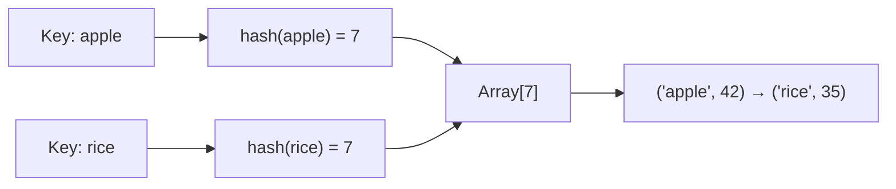

## Almost Always Hashmap

If you use hashmaps for Leetcode problems, you can probably solve half of them.

Hashmaps are one of the most efficient data structures, so it's worth understanding how they actually work.

## How do hashmaps work?

A hashmap works like a drawer system.

When you use a hash function on a key, it tells you which drawer (array index) the value belongs to. That’s why accessing an element in a hashmap usually takes **O(1)** time -- you go straight to the right drawer.

However, sometimes two different keys get mapped to the same drawer. When that happens (called a collision), the hashmap stores both items in that same drawer as a small list. If there are too many items in one drawer, you’ll need to look through them, which can take up to **O(n)** time.
